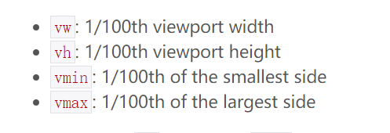
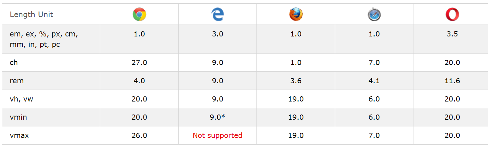

# 关于移动端vh、vw、vmin、vmax在不同浏览器下的调研

 在此次调研中我使用了以下css3元素作比较

 - %：定义基于包含块（父元素）的百分比宽度
 - vh：1vh等于视窗(viewport，也可以叫做视区、视界或可视范围)高度的1%
 - vw：1vw等于视窗(viewport，也可以叫做视区、视界或可视范围)宽度的1%
 - vmax：vh,vw中最大值
 - vmin：vh，vw中最小值

 
 - rem：相对于根元素的字体大小的单位
 - em：相对于父元素的字体大小的单位

 

以下是支持vh、vw的浏览器版本

## 移动端的浏览器内核。

### 一、分类

目前移动设备浏览器上常用的内核有 Webkit，Blink，Trident，Gecko 等，其中 iPhone 和 iPad 等苹果 iOS 平台主要是 WebKit，Android 4.4 之前的 Android 系统浏览器内核是 WebKit，Android4.4 系统浏览器切换到了Chromium，内核是 Webkit 的分支 Blink，Windows Phone 8 系统浏览器内核是 Trident。

在此次调研中，我分别用了以下浏览器

- QQ浏览器-(X5内核)
- Safari(Webkit)
- UC浏览器(U3内核)
- 百度浏览器(Blink/Trident内核)
- 魅族内置浏览器(WebKit内核)
- Chrome浏览器(WebKit)

### 二、各浏览器内核的简单介绍

1. Trident
IE浏览器使用的内核,缺陷：一是Trident内核曾经几乎与W3C标准脱节（2005年），二是Trident内核的大量 Bug等安全性问题没有得到及时解决。

2. Gecko
Netscape6开始采用的内核，后来的Mozilla FireFox (火狐浏览器) 也采用了该内核，Gecko的特点是代码完全公开，因此，其可开发程度很高，全世界的程序员都可以为其编写代码，增加功能。

3. Presto
目前Opera采用的内核，该内核在2003年的Opera7中首次被使用，该款引擎的特点就是渲染速度的优化达到了极致，也是目前公认网页浏览速度最快的浏览器内核，然而代价是牺牲了网页的兼容性。实际上这是一个动态内核，与前面几个内核的最大的区别就在脚本处理上，Presto有着天生的优势，页面的全部或者部分都能够在回应脚本事件时等情况下被重新解析。只是Presto是商业引擎。

4. Webkit
苹果公司的内核，也是苹果的Safari浏览器使用的内核。Webkit也是自由软件，同时开放源代码。

### 三、浏览器中的单核与双核
   浏览器双核是指有两套软件用来展示网页（即渲染引擎），如果一个引擎展示某个网站失败，就会自动换用引擎，保证网页完美显示。

   1. Trident/Gecko双核浏览器 
   2. Trident/WebKit双核浏览器
   3. Trident/Gecko/WebKit三核浏览器 
