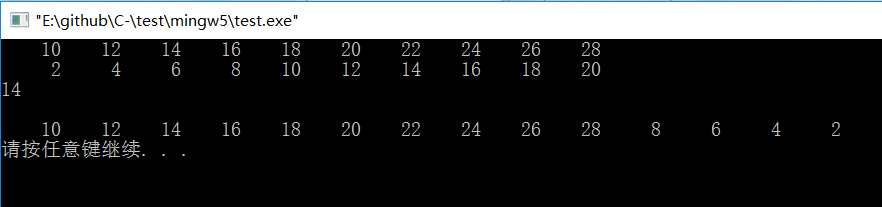

# 合并的总结

这是个有趣的现象，我们会发现如果把两个顺序表合并起来，当需要在La中插入不存在于La的Lb元素，我们可以这样写： **ListInsert_Sq(La,La_len,e);**

结果是插入的元素是逆序插入到La的后面:

也可以这样写 ：**ListInsert_Sq(La,La_len++,e);**
结果是插入的元素正序插入到La的后面:

而如果像书本写的那样 **ListInsert_Sq(La,++La_len,e);** 结果则是完全没有插入任何元素:

为什么会这样呢？为什么第一种写法不会导致之前插入的元素被后面插入的元素覆盖？为什么第三种写法根本不起作用？

**首先解释一个容易误解的坑，经实验，ListInsert_Sq执行后会让La的长度自动增加，但是La_len不会随着La的长度自动增加，必须加一行让它长度增加的代码或者直接加++；**

因为顺序表的插入函数是在最后一个结点之前添加一个元素，对于第一种写法，我们是在最后一个元素之前一直插入元素，所以结果是逆序的，不会覆盖，也不会报错。第二种写法则是在La的最后一个元素的后一个位置上插入元素，++后使得La的最后一个元素永远为空，然后e插入到最后一个元素上，所以是正序插入，也不会报错。对于第三种写法，我们能想象在插入之前我们先++的话就是在La最后一个元素的后一个位置的后一个位置之前插入了一个元素，对于La来说，它根本不知道这个位置在哪里，所以就插入失败了。

然而当实现单链表合并时，情况又不同。在实现插入操作时，我们可以这样写：**ListInsert_L( La,La_len++,e)** 

结果是对于不存在与La的Lb元素，都是正序插入到La元素的最后一个元素前。

我们也可以这样写：（将上图插入语句改成）**ListInsert_L( La,++La_len,e) ;**

结果是对于不存在与La的Lb元素，都是正序得插入至La最后元素后面。

那你可能会问，能不能像顺序表那样不++呢？~~经实验，如果插入语句不++，即ListInsert_L( La,La_len,e) ;只有一个元素能被插入至La最后一个元素之前，其它的都无法插入。~~

~~可以看出这样的结果没有实现我们的要求。~~

为什么会这样呢？还记得单链表的ListInsert_L函数是怎么实现的吗？它只是将一个要插入的结点的变成前一个结点的next，再将原来的next变成它的next而已，对于有头结点的单链表，它的第length个元素就是它的最后一个元素，所以第一种写法就是在最后一个元素之前一直插入元素，插入之后再让插入的位置向后挪一个，但是永远在最后一个元素之前；第二种写法就是先向后挪一个位置，再将要插入的结点和最后一个结点连起来。**第三种写法我一开始也不知道是什么原因，自认为代码应该是没问题的，但是经过实验我发现，我的代码有问题！其实第三种写法也是可以的哦，只需要改一个地方。** 想想？是的，你应该看出来了！我踩了一个坑，我的if语句有点特殊，为什么是==La_len-1，因为书上的LocateElem_L_2这个函数，当能找到返回的时候下标是从-1开始的，所以下标应该最后一个是**ListLength_L( La )-2**，而找不到的时候返回的是**ListLength_L( La )-2+1**，所以我踩的坑是：**La_len不会随着ListLength_L( La )变化，所以b链表1后面的所有元素都没有进入if语句，只有1进入了。只需要把La_len-1改成ListLength_L( La )-1就行。注意注意~~逆序来啦！**

